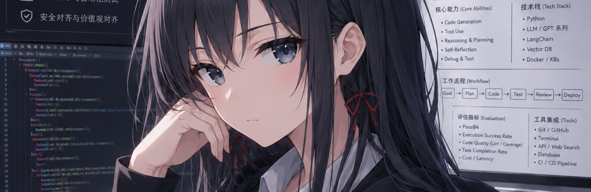
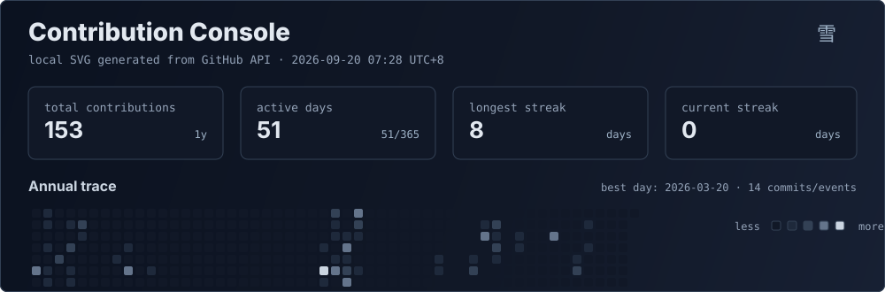
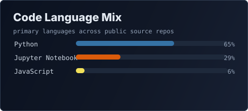
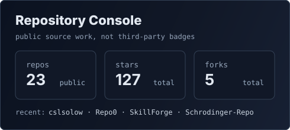
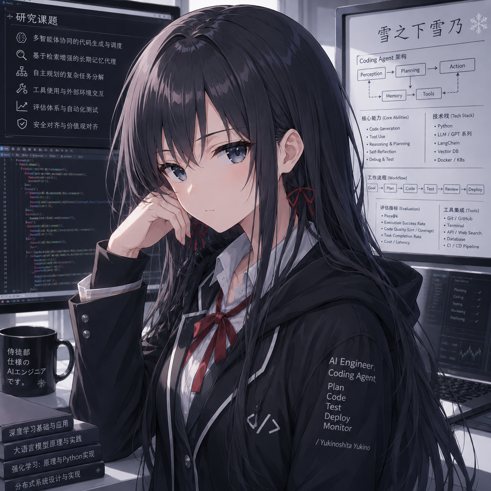

  

<h1 align="center">Silin Chen · cslsolow</h1>

  AI4SE researcher · LLM agent builder · repository-level software engineering

  
  
  
  

---

### 雪之下研究室

I work on **AI for Software Engineering**, especially LLM-based coding agents,
repository-level code understanding, automated debugging, and evaluation for
software issue resolution.

| Focus | What I Care About |
| --- | --- |
| Coding agents | perception, planning, memory, tool use, debugging, testing |
| Repository-level SE | long-context code understanding, dependency reasoning, issue localization |
| Issue synthesis | bug injection, task construction, reproducible issue generation |
| Evaluation | SWE-bench style tasks, verifiable tests, benchmark reliability |
| Research systems | reproducible pipelines, provenance, knowledge bases, paper engineering |

---

### Selected Projects

| Project | Stars | Direction |
| --- | ---: | --- |
| [SWE-Exp](https://github.com/cslsolow/SWE-Exp) |  | Experience-driven software issue resolution for LLM agents |
| [SeeRepo](https://github.com/cslsolow/SeeRepo) |  | Helping LLM agents see and reason over code repositories |
| [shanhaijing](https://github.com/cslsolow/shanhaijing) |  | LLM-compiled personal research knowledge base |
| [Awesome-Repo-Level-Code-Generation](https://github.com/YerbaPage/Awesome-Repo-Level-Code-Generation) |  | Papers on repository-level code generation and issue resolution |

---

### Contribution Console

  

  
  

  <picture>
    <source media="(prefers-color-scheme: dark)" srcset="https://raw.githubusercontent.com/cslsolow/cslsolow/output/github-contribution-grid-snake-dark.svg" />
    <source media="(prefers-color-scheme: light)" srcset="https://raw.githubusercontent.com/cslsolow/cslsolow/output/github-contribution-grid-snake.svg" />
    
  </picture>

---

### Tech Stack

  
  
  
  
  
  

---

Yukino-themed profile notes

This profile uses a cold, restrained visual style: snow, dark terminals, quiet
research boards, and agent engineering diagrams. The point is not to make the
README louder. The point is to make the research identity more memorable.

If a visual element does not help people understand what I build, it does not
belong here. Yes, even if it is pretty. Especially then.

  

  雪ノ下雪乃 · AI Engineering · Code, Test, Review

